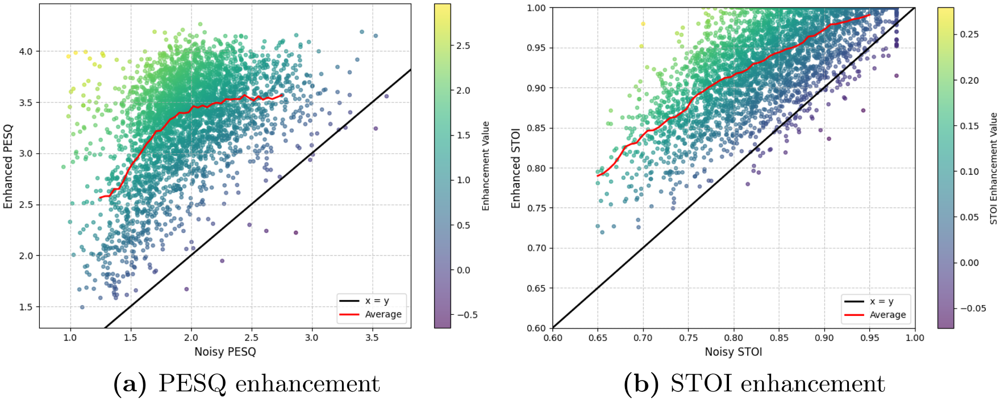

<div align="center">
  
</div>

<p align="center">
  <a href="https://doi.org/10.1016/j.dsp.2026.105987"></a>
  <a href="https://doi.org/10.1016/j.dsp.2026.105987"></a>
  <a href="LICENSE"></a>
</p>

<p align="center">
  Official PyTorch implementation of<br />
  <strong>Lightweight speech enhancement with state-space model and depthwise separable convolution</strong>
</p>

<p align="center">
  Chen Jiang<sup>*</sup> · Dai Gao<sup>*</sup> · Sirui Wang · Chengxuan Zou · Jie Liu<br />
  <sub><sup>*</sup>Equal contribution · Digital Signal Processing, Volume 174, 2026</sub>
</p>

## At a glance

The model combines a lightweight state-space FeatureMask with depthwise separable convolution, psychoacoustic spectral compression, multi-scale context modeling, and lightweight phase refinement. It is designed for a strong quality–efficiency trade-off rather than post-hoc model compression.

<div align="center">
  
</div>

### Why it is lightweight

- **AISC** preserves low-frequency detail while compressing high-frequency bins through a fixed ERB filter bank.
- **DSConv + ASPP** extracts multi-scale context with substantially lower cost than standard convolution.
- **LightS4 FeatureMask** models long-range time–frequency dependencies along two paths.
- **GLA refinement** improves phase with only three Griffin–Lim iterations.
- **Auxiliary speaker classification** strengthens enhancement in human-voice interference during training only.

## Architecture

<div align="center">
  
</div>

<p align="center"><sub>Figure 1 from the paper. The classifier is used during training; Griffin–Lim refinement is used during inference.</sub></p>

## Results

### VoiceBank + DEMAND

| Model | Params ↓ | MACs ↓ | PESQ ↑ | STOI ↑ |
|---|---:|---:|---:|---:|
| DeepFilterNet3 | 2.31M | **0.36G** | 3.17 | 0.94 |
| DeConformer-SENet | **1.57M** | 3.05G | 3.24 | **0.96** |
| SEMamba | 2.25M | 32.73G | **3.52** | **0.96** |
| **Ours** | 1.65M | 0.50G | 3.32 | **0.96** |

Compared with SEMamba, the proposed model uses about **65× fewer MACs** while retaining competitive perceptual quality. On an Intel Core i5-1135G7 CPU, the paper reports an **RTF of 0.13**.

### Robustness across noise levels

<div align="center">
  
</div>

<p align="center"><sub>Figure 10 from the paper. Points above the identity line indicate enhancement over the noisy input.</sub></p>

<details>
<summary><strong>View qualitative ablation visualization</strong></summary>
<br />
<div align="center">
  
</div>
<p align="center"><sub>Figure 7 from the paper: clean, noisy, enhanced, and key module ablations.</sub></p>
</details>

## Quick start

### 1. Install

```bash
git clone https://github.com/j128djsj/Lightweight-Speech-Enhancement.git
cd Lightweight-Speech-Enhancement
python -m venv .venv
source .venv/bin/activate  # Windows: .venv\Scripts\activate
pip install -e .
```

Install profiling extras only when needed:

```bash
pip install -e ".[profile]"
```

### 2. Prepare metadata

Training consumes JSON lists that pair clean speech with a noise recording:

```json
[
  {
    "clean": "/path/to/clean/p226_001.wav",
    "noise": "/path/to/noise/babble.wav"
  }
]
```

Speaker labels for the auxiliary classifier are inferred from clean filenames such as `p226_001.wav`.

### 3. Train

```bash
python scripts/train.py \
  --train_noisy_json /path/to/train_noisy.json \
  --valid_noisy_json /path/to/valid_noisy.json
```

The defaults reproduce the paper configuration: 16 kHz audio, 2 s training segments, a 400-point STFT with 100-point hop, Adam at `5e-4`, exponential decay `0.99`, and 150 epochs.

### 4. Profile

```bash
python scripts/profile_model.py --num_speakers 28
python scripts/profile_discriminator.py
python scripts/profile_flops.py
```

> [!NOTE]
> `profile_flops.py` uses THOP. Because LightS4 contains FFT operations, exact MAC accounting may require custom THOP handlers.

## Repository map

```text
.
├── assets/                         # README visuals from the paper
├── scripts/
│   ├── train.py                    # training entry point
│   ├── profile_model.py            # parameter profiling
│   ├── profile_flops.py            # MAC profiling
│   └── profile_discriminator.py
└── src/speech_enhancement/
    ├── config.py                   # paper defaults
    ├── data/                       # VoiceBank + DEMAND pipeline
    ├── dsp/                        # STFT utilities
    ├── models/                     # AISC, DSConv, ASPP, LightS4, decoder
    └── training/                   # losses, metrics, evaluation, checkpoints
```

## Citation

If this repository is useful in your research, please cite the paper:

```bibtex
@article{jiang2026lightweight,
  title   = {Lightweight speech enhancement with state-space model and depthwise separable convolution},
  author  = {Jiang, Chen and Gao, Dai and Wang, Sirui and Zou, Chengxuan and Liu, Jie},
  journal = {Digital Signal Processing},
  volume  = {174},
  pages   = {105987},
  year    = {2026},
  doi     = {10.1016/j.dsp.2026.105987}
}
```

## License and paper assets

The source code is released under the [MIT License](LICENSE). Figures reproduced from the article are included for scholarly description and attribution and are **not** covered by the code license; see [NOTICE.md](NOTICE.md).

