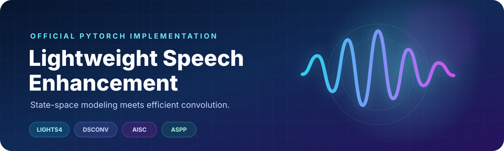
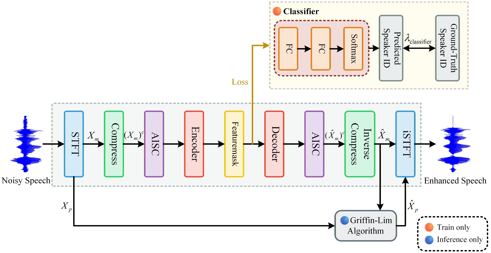
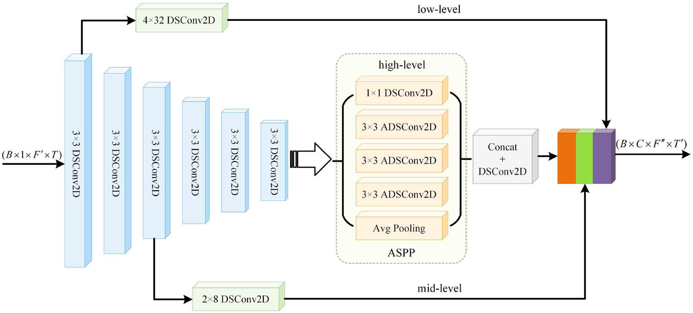
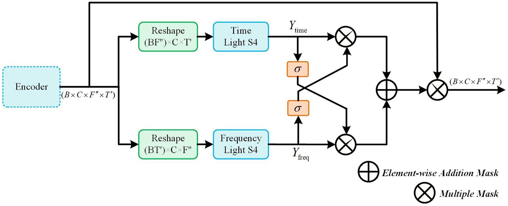
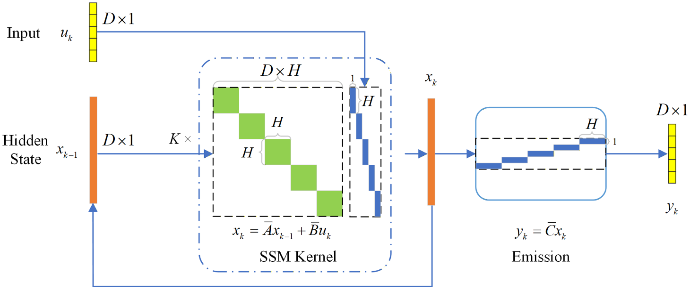
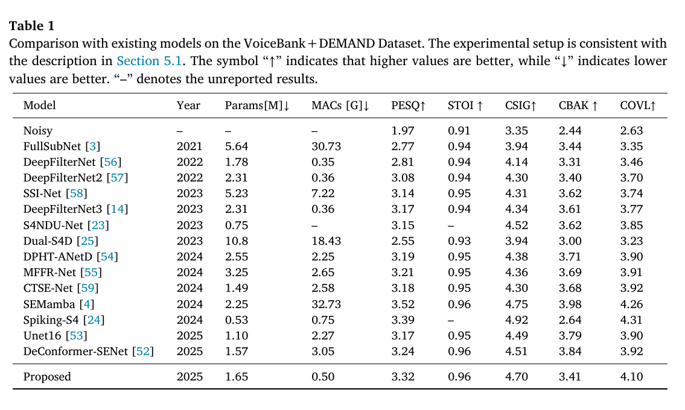
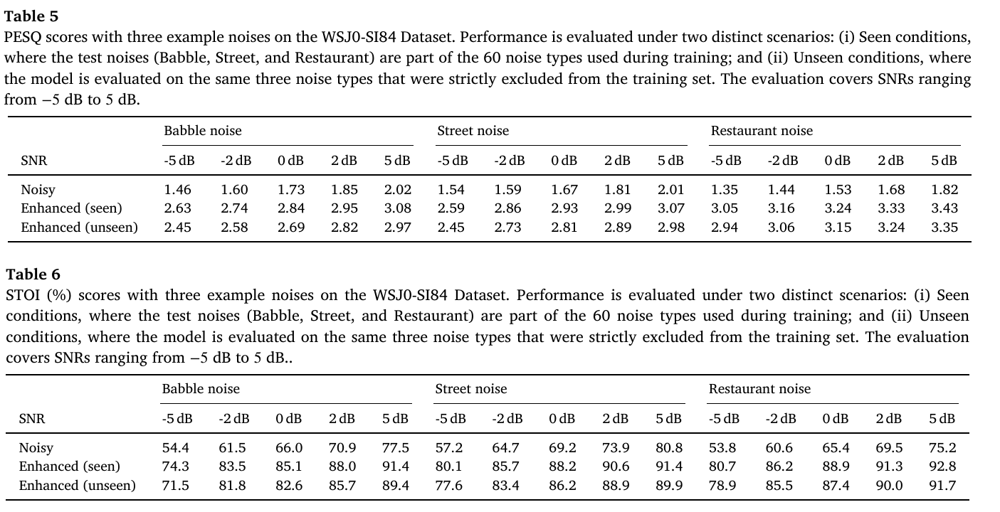
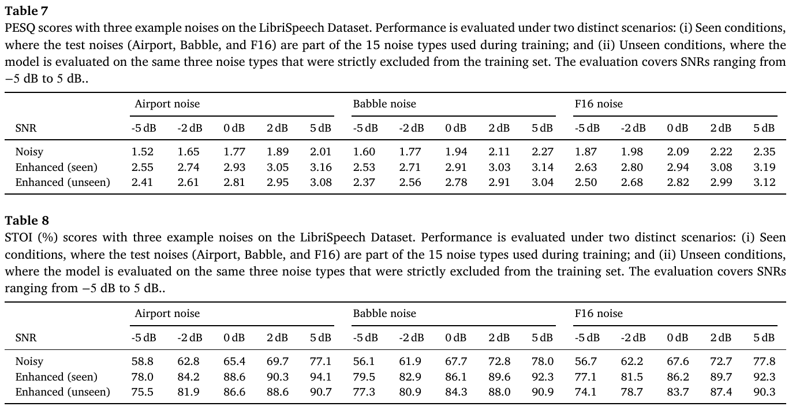

<div align="center">
  
</div>

<p align="center">
  <a href="https://doi.org/10.1016/j.dsp.2026.105987"></a>
  <a href="https://doi.org/10.1016/j.dsp.2026.105987"></a>
  <a href="LICENSE"></a>
</p>

<p align="center">
  Official PyTorch implementation of<br />
  <strong>Lightweight speech enhancement with state-space model and depthwise separable convolution</strong>
</p>

<p align="center">
  Chen Jiang<sup>*</sup> · Dai Gao<sup>*</sup> · Sirui Wang · Chengxuan Zou · Jie Liu<br />
  <sub><sup>*</sup>Equal contribution · Digital Signal Processing, Volume 174, 2026</sub>
</p>

## At a glance

The model combines a lightweight state-space FeatureMask with depthwise separable convolution, psychoacoustic spectral compression, multi-scale context modeling, and lightweight phase refinement. On VoiceBank + DEMAND, it reaches **PESQ 3.32** and **STOI 0.956** with only **1.65M parameters** and **0.50G MACs**.

### Why it is lightweight

- **AISC** preserves low-frequency detail while compressing high-frequency bins through a fixed ERB filter bank.
- **DSConv + ASPP** extracts multi-scale context with substantially lower cost than standard convolution.
- **LightS4 FeatureMask** models long-range time–frequency dependencies along two paths.
- **GLA refinement** improves phase with only three Griffin–Lim iterations.
- **Auxiliary speaker classification** strengthens enhancement in human-voice interference during training only.

## Architecture

<div align="center">
  
</div>

<p align="center"><sub>Figure 1 from the paper. The classifier is used during training; Griffin–Lim refinement is used during inference.</sub></p>

### Module breakdown

#### Encoder: DSConv2D + ASPP

The encoder fuses low-, mid-, and high-level representations while ASPP captures multi-scale context with efficient atrous depthwise separable convolution.

<div align="center">
  
</div>

<p align="center"><sub>Figure 2 from the paper: depthwise separable encoder with multi-level feature fusion and ASPP.</sub></p>

#### Dual-path FeatureMask

Temporal and frequency LightS4 paths exchange information through cross-gating before producing the enhancement mask.

<div align="center">
  
</div>

<p align="center"><sub>Figure 3 from the paper: dual-path time-frequency FeatureMask.</sub></p>

#### LightS4 state-space block

LightS4 uses a compact state-space kernel to model long-range dependencies with a structured hidden state and efficient emission step.

<div align="center">
  
</div>

<p align="center"><sub>Figure 4 from the paper: internal state-space computation of LightS4.</sub></p>

## Results

### VoiceBank + DEMAND

<div align="center">
  
</div>

<p align="center"><sub>Table 1 from the paper: comparison with existing models on VoiceBank + DEMAND.</sub></p>

Compared with SEMamba, the proposed model uses about **65× fewer MACs** while retaining competitive perceptual quality. On an Intel Core i5-1135G7 CPU, the paper reports an **RTF of 0.13**.

### Cross-dataset generalization

The paper evaluates seen and strictly held-out noise conditions across two additional speech corpora, with SNRs ranging from −5 dB to 5 dB.

#### WSJ0-SI84

<div align="center">
  
</div>

<p align="center"><sub>Tables 5–6 from the paper: PESQ and STOI under seen and unseen noises on WSJ0-SI84.</sub></p>

#### LibriSpeech

<div align="center">
  
</div>

<p align="center"><sub>Tables 7–8 from the paper: PESQ and STOI under seen and unseen noises on LibriSpeech.</sub></p>

## Quick start

### 1. Install

```bash
git clone https://github.com/j128djsj/Lightweight-Speech-Enhancement.git
cd Lightweight-Speech-Enhancement
python -m venv .venv
source .venv/bin/activate  # Windows: .venv\Scripts\activate
pip install -e .
```

Install profiling extras only when needed:

```bash
pip install -e ".[profile]"
```

### 2. Prepare metadata

Training consumes JSON lists that pair clean speech with a noise recording:

```json
[
  {
    "clean": "/path/to/clean/p226_001.wav",
    "noise": "/path/to/noise/babble.wav"
  }
]
```

Speaker labels for the auxiliary classifier are inferred from clean filenames such as `p226_001.wav`.

### 3. Train

```bash
python scripts/train.py \
  --train_noisy_json /path/to/train_noisy.json \
  --valid_noisy_json /path/to/valid_noisy.json
```

The defaults reproduce the paper configuration: 16 kHz audio, 2 s training segments, a 400-point STFT with 100-point hop, Adam at `5e-4`, exponential decay `0.99`, and 150 epochs.

### 4. Profile

```bash
python scripts/profile_model.py --num_speakers 28
python scripts/profile_discriminator.py
python scripts/profile_flops.py
```

> [!NOTE]
> `profile_flops.py` uses THOP. Because LightS4 contains FFT operations, exact MAC accounting may require custom THOP handlers.

## Repository map

```text
.
├── assets/                         # model figure and original result tables
├── scripts/
│   ├── train.py                    # training entry point
│   ├── profile_model.py            # parameter profiling
│   ├── profile_flops.py            # MAC profiling
│   └── profile_discriminator.py
└── src/speech_enhancement/
    ├── config.py                   # paper defaults
    ├── data/                       # VoiceBank + DEMAND pipeline
    ├── dsp/                        # STFT utilities
    ├── models/                     # AISC, DSConv, ASPP, LightS4, decoder
    └── training/                   # losses, metrics, evaluation, checkpoints
```

## Citation

If this repository is useful in your research, please cite the paper:

```bibtex
@article{jiang2026lightweight,
  title   = {Lightweight speech enhancement with state-space model and depthwise separable convolution},
  author  = {Jiang, Chen and Gao, Dai and Wang, Sirui and Zou, Chengxuan and Liu, Jie},
  journal = {Digital Signal Processing},
  volume  = {174},
  pages   = {105987},
  year    = {2026},
  doi     = {10.1016/j.dsp.2026.105987}
}
```

## License and paper assets

The source code is released under the [MIT License](LICENSE). Figures reproduced from the article are included for scholarly description and attribution and are **not** covered by the code license; see [NOTICE.md](NOTICE.md).
